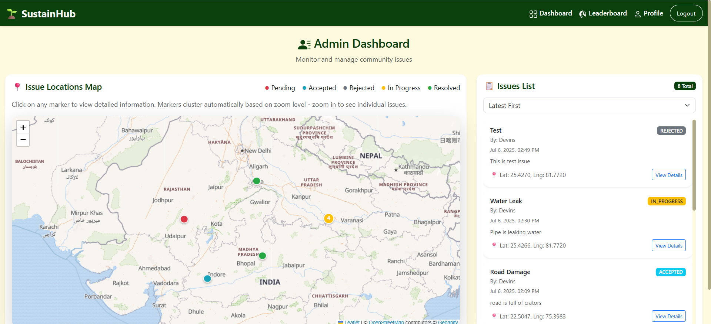
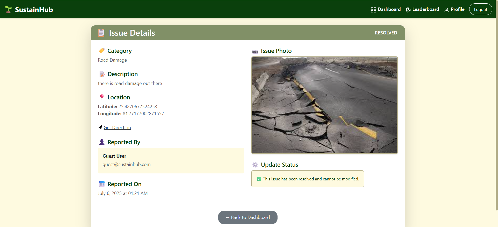
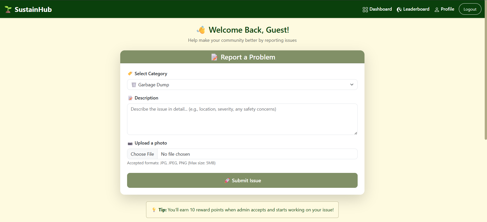
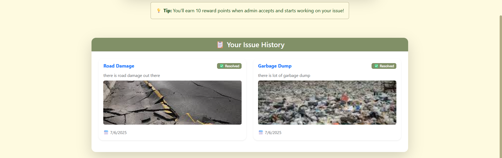

# [Sustain Hub 🔗](https://sustainhub.pages.dev)

## Overview
Sustain Hub [(Visit)](https://sustainhub.pages.dev) is a comprehensive web platform designed to empower citizens to report and track public facility issues within their local community while earning reward points. The platform provides an intuitive interface that makes it easy for users to pinpoint problems and submit detailed reports with photos and precise location data. Local authorities can efficiently track, manage, and resolve reported issues through a dedicated admin dashboard.

## Quick Design Overview

| Section            | Screenshot                                    |
|--------------------|-----------------------------------------------|
| **Admin Dashboard**|  |
| **Issue Details**  |      |
| **User Dashboard** |    |
| **Issue History**  |      |

> _Explore the platform's main features visually. Each section below demonstrates a key part of the user or admin experience._


## Key Features

### For Citizens
- **User Registration & Authentication** - Secure account creation and login system
- **Issue Reporting** - Report problems with category selection, detailed descriptions, and photo uploads
- **Automatic Location Detection** - GPS-based location tagging for precise issue positioning
- **Reward System** - Earn points for reporting issues (10 points per verified report)
- **Leaderboard** - Compete with other users and see your ranking based on reward points earned for reporting and resolving issues. Top contributors are highlighted to encourage community participation.
- **Profile Management** - Update personal information and track reward points
- **Real-time Status Updates** - Track the progress of reported issues

### For Administrators
- **Admin Dashboard** - Comprehensive overview of all reported issues
- **Interactive Map Interface** - Visual representation of issues using Geoapify maps
- **Issue Management** - Update issue status (Pending → In Progress → Resolved)
- **Detailed Issue Views** - Access complete information including photos and reporter details
- **Status-based Color Coding** - Visual indicators for issue priorities and status

### Technical Features
- **Responsive Design** - Mobile-friendly interface using Bootstrap
- **Secure Authentication** - JWT-based authentication with role-based access control
- **Image Storage** - Cloudinary integration for reliable image hosting
- **Database Security** - MongoDB with proper data validation and sanitization
- **API Documentation** - RESTful API endpoints with proper error handling

## Tech Stack

### Frontend
- **React 18** - Modern JavaScript library for building user interfaces
- **Bootstrap 5** - Responsive CSS framework
- **React Bootstrap** - Bootstrap components for React
- **Axios** - HTTP client for API requests

### Backend
- **Node.js** - JavaScript runtime environment
- **Express.js** - Web application framework
- **MongoDB** - NoSQL database for data storage
- **JWT (JSON Web Tokens)** - Secure authentication
- **bcryptjs** - Password hashing
- **Multer** - File upload handling
- **Cloudinary** - Cloud-based image storage

### Maps & Location
- **Geoapify API** - Interactive maps and geocoding services
- **Browser Geolocation API** - Automatic location detection

### Development Tools
- **nodemon** - Development server with auto-restart
- **dotenv** - Environment variable management
- **express-validator** - Input validation and sanitization

## Project Structure

```
SustainHub/
├── frontend/                 # React frontend application
│   ├── public/              # Static assets
│   ├── src/
│   │   ├── components/      # Reusable React components
│   │   ├── pages/           # Page components (Home, Dashboard, etc.)
│   │   ├── context/         # React context for state management
│   │   ├── App.js           # Main application component
│   │   └── index.js         # Application entry point
│   ├── package.json         # Frontend dependencies
│   └── .env                 # Frontend environment variables
│
├── backend/                 # Node.js backend application
│   ├── models/              # MongoDB models (User, Issue)
│   ├── routes/              # API route handlers
│   ├── middleware/          # Authentication middleware
│   ├── server.js            # Express server setup
│   ├── package.json         # Backend dependencies
│   └── .env                 # Backend environment variables
│
├── LICENSE                  # MIT License
└── README.md               # Project documentation
```

## API Endpoints

### Authentication
- `POST /api/auth/register` - User registration
- `POST /api/auth/login` - User login

### Users
- `GET /api/users/profile` - Get user profile
- `PUT /api/users/profile` - Update user profile
- `GET /api/users/:id` - Get user by ID (admin)

### Issues
- `POST /api/issues` - Create new issue
- `GET /api/issues/admin/all` - Get all issues (admin)
- `GET /api/issues/admin/map` - Get map data for admin
- `GET /api/issues/:id` - Get issue details
- `GET /api/issues/user/my-issues` - Get user's issues
- `PUT /api/issues/:id/status` - Update issue status (admin)

### File Upload
- `POST /api/upload/image` - Upload issue image

## Installation & Setup

### Prerequisites
- Node.js (v14 or higher)
- npm or yarn package manager
- MongoDB Atlas account (or local MongoDB installation)
- Cloudinary account for image storage
- Geoapify API key

### Environment Variables

Create `.env` files in both frontend and backend directories:

#### Backend (.env)
```env
PORT=5000
MONGODB_URI=your_mongodb_connection_string
JWT_SECRET=your_jwt_secret_key
CLOUDINARY_CLOUD_NAME=your_cloudinary_cloud_name
CLOUDINARY_API_KEY=your_cloudinary_api_key
CLOUDINARY_API_SECRET=your_cloudinary_api_secret
```

#### Frontend (.env)
```env
REACT_APP_API_BASE_URL=http://localhost:5000/api
REACT_APP_GEOAPIFY_API_KEY=your_geoapify_api_key
```

### Installation Steps

1. **Clone the repository**
   ```bash
   git clone https://github.com/kushal7201/SustainHub
   cd SustainHub
   ```

2. **Install Backend Dependencies**
   ```bash
   cd backend
   npm install
   ```

3. **Install Frontend Dependencies**
   ```bash
   cd ../frontend
   npm install
   ```

4. **Set up Environment Variables**
   - Create `.env` files in both `backend/` and `frontend/` directories
   - Add the required environment variables as shown above

5. **Start the Development Servers**

   **Backend (Terminal 1):**
   ```bash
   cd backend
   npm run dev
   ```

   **Frontend (Terminal 2):**
   ```bash
   cd frontend
   npm start
   ```

6. **Access the Application**
   - Frontend: http://localhost:3000
   - Backend API: http://localhost:5000

## Usage

### For Citizens
1. **Register/Login** - Create an account or sign in
2. **Report Issues** - Click "Report a Problem" and fill out the form
3. **Add Details** - Select category, add description, and upload a photo
4. **Submit** - Your location will be automatically detected and the issue submitted
5. **Track Progress** - View your profile to see reward points and issue status

### For Administrators
1. **Admin Login** - Use admin credentials to access the admin dashboard
2. **View Map** - See all reported issues on the interactive map
3. **Manage Issues** - Click on markers to view detailed information
4. **Update Status** - Change issue status from Pending → In Progress → Resolved
5. **Monitor Progress** - Track community issues and response effectiveness

## Contributing

1. Fork the repository
2. Create a feature branch (`git checkout -b feature/new-feature`)
3. Commit your changes (`git commit -am 'Add new feature'`)
4. Push to the branch (`git push origin feature/new-feature`)
5. Create a Pull Request

## Security Features

- **JWT Authentication** - Secure token-based authentication
- **Password Hashing** - bcrypt for secure password storage
- **Input Validation** - Server-side validation for all inputs
- **CORS Protection** - Configured cross-origin resource sharing
- **Environment Variables** - Sensitive data stored securely
- **Role-based Access** - Different permissions for users and admins

## License

This project is licensed under the MIT License - see the [LICENSE](LICENSE) file for details.

## Support

For support, issues, or feature requests, please:
1. Open an issue on GitHub
2. Contact the development team

---

**Made with ❤️ for building better communities**
